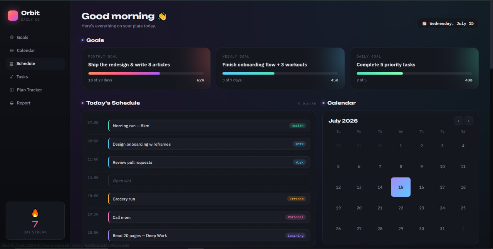
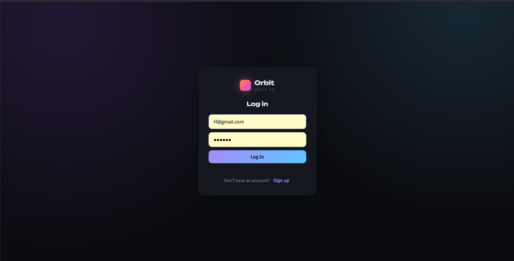
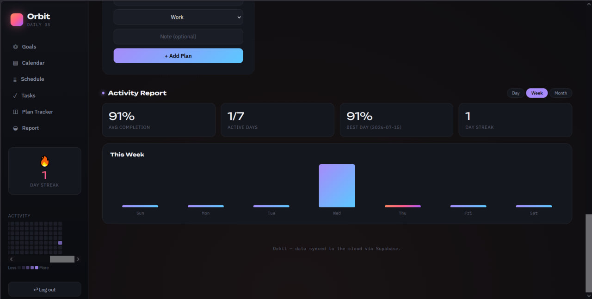

# Orbit — Daily Activity Dashboard

A dark-themed, PWA-ready daily activity dashboard with task management,
streak tracking, realtime sync, GitHub-style heatmap, and offline support.

Built with vanilla HTML/CSS/JS + Supabase — no bundler, no build step.

## Features

**Task management**
- Add, edit, delete, and toggle tasks
- 5 categories (Work, Personal, Health, Learning, Errands) with color coding
- 3 priority levels (high / medium / low)
- Subtasks / checklists per task
- Recurring tasks (daily, weekly patterns)
- Per-task reminder notifications
- Search and filter by text, category, or date scope

**Dashboard**
- Today's task list with priority view
- Schedule / timeline view ordered by time
- Calendar with task-dot indicators
- Daily completion % bar chart (last 7 days)
- Monthly / weekly bucket reports
- 365-day GitHub-style contribution heatmap

**Streak & Goals**
- Streak counter (resets if a day is missed, confetti on all tasks done)
- Monthly, weekly, and daily goal cards with progress bars
- Plan tracker with SVG circular progress rings

**Auth & Sync**
- Email / password authentication via Supabase Auth
- Inline login / sign-up overlay (no page redirect)
- Row Level Security — users only see their own data
- Realtime sync across tabs and devices (via Supabase postgres_changes)

**PWA & Offline**
- Service worker caches app shell for offline access
- Offline write queue in localStorage — flushes when connection returns
- Manifest + icons for install-to-homescreen

## Screenshots


*Main dashboard showing task list, calendar, and sidebar with streak and heatmap.*


*Inline login / sign-up overlay with dark theme.*


*365-day activity heatmap with hover tooltips.*

## Tech Stack

| Layer | Technology |
|---|---|
| Frontend | Vanilla HTML / CSS / JS (ES modules) |
| Auth | Supabase Auth (email / password) |
| Database | Supabase PostgreSQL + Row Level Security |
| Realtime | Supabase Realtime (postgres_changes) |
| Hosting | Vercel (static export) |
| Icons | Inline SVG and Unicode |

## Getting Started

### 1. Supabase setup

1. Create a Supabase project at [supabase.com](https://supabase.com) (free tier).
2. Go to **SQL Editor**, paste the contents of `sql/schema.sql`, and run it.
3. Go to **Project Settings → API** and copy your **Project URL** and **anon / public** key.

### 2. Local development

```sh
cp js/config.example.js js/config.js
```

Paste your Project URL and anon key into `js/config.js`.

```sh
npx serve .
# Open http://localhost:3000
```

> Opening `index.html` via `file://` won't work — ES module imports require an HTTP server.

## Deploy to Vercel

1. Push the repo to GitHub.
2. In the Vercel dashboard, click **Add New → Project** and import your repo.
3. In **Environment Variables**, add:
   - `SUPABASE_URL` — your Supabase project URL
   - `SUPABASE_ANON_KEY` — your Supabase anon key
4. Deploy. The build command (`node scripts/generate-config.js`) will create `js/config.js` from the environment variables at deploy time.

## Project Structure

```
index.html                  All markup + inline CSS (~700 lines)
js/
  app.js                    Core app logic, UI handlers, rendering (~1200 lines)
  store.js                  Data access layer — all Supabase queries (~490 lines)
  supabase-client.js        Shared Supabase client creation
  config.example.js         Template for Supabase credentials
sql/
  schema.sql                Database schema + RLS policies + indexes
scripts/
  generate-config.js        Build-time config file generator (used by Vercel)
screenshots/                Dashboard screenshots for README
manifest.json               PWA manifest
sw.js                       Service worker
```

## License

MIT
